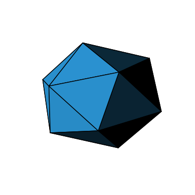

# Applied Linear Algebra: Computational Studies

A portfolio collection of four computational studies that apply linear algebra to stochastic modeling, error correction, 3D geometry, and image compression.

The work was completed in an academic setting. The original notebooks, reports, and data artifacts are preserved byte-for-byte; the surrounding repository structure and documentation were added only to make the work easier to review.

## Project overview

| Study | Main ideas | Preserved artifacts |
|---|---|---|
| [Markov-chain text generation](projects/01-markov-chain-text-generation/) | n-gram state construction, transition matrices, probabilistic generation, stationary distributions | Jupyter notebook |
| [Hamming (7,4) error correction](projects/02-hamming-74-error-correction/) | vector spaces over GF(2), parity checks, syndrome decoding, single-bit correction, binary-file recovery | Jupyter notebook, handwritten report, corrupted input, recovered PDF |
| [3D flat shading](projects/03-3d-flat-shading/) | view vectors, cross products, face visibility, lighting intensity, OBJ parsing, vertex normals | Jupyter notebook, OBJ model |
| [SVD image compression](projects/04-svd-image-compression/) | truncated singular-value decomposition, low-rank reconstruction, compression ratio, reconstruction error | Jupyter notebook, illustrated report |

## Technical highlights

- Constructs a dense Markov transition matrix from n-grams and estimates a stationary distribution by power iteration.
- Implements Hamming (7,4) encoding, syndrome-based single-bit correction, and reconstruction of an intentionally damaged binary file.
- Applies vector normalization, cross products, dot products, reflection geometry, and averaged face normals to render an icosahedron.
- Uses truncated SVD to reconstruct grayscale images and compare storage ratio, relative difference, and singular-value decay.

## Selected recorded outputs

### Flat-shaded icosahedron

The figure below was extracted from the stored output of the preserved notebook. It is a derived preview; the notebook itself was not edited.



### Rank-50 SVD reconstruction

The preserved image-compression notebook records a 500 x 500 grayscale example reconstructed at rank 50. Its stored output reports a compression ratio of `0.200200` and an average relative difference of `0.051343`.


## Repository structure

```text
.
├── projects/
│   ├── 01-markov-chain-text-generation/
│   ├── 02-hamming-74-error-correction/
│   ├── 03-3d-flat-shading/
│   └── 04-svd-image-compression/
├── docs/
├── ORIGINAL_FILE_MANIFEST.tsv
├── requirements.txt
└── README.md
```

## Running the notebooks

```bash
python3 -m venv .venv
source .venv/bin/activate
pip install -r requirements.txt
jupyter lab
```

Open the notebook inside the relevant project folder.

Some notebooks rely on files or services from their original environment:

- The Markov-chain notebook downloads NLTK's `punkt` tokenizer data.
- The Hamming-code notebook expects its corrupted binary input in the working directory.
- The flat-shading notebook may require an animation writer such as ImageMagick or Pillow to save a GIF.
- The SVD notebook references an original JPEG that was not present in the uploaded archive. Its historical notebook output and report are preserved, but reproducing that exact run requires the missing image.

## Preservation policy

The portfolio copies listed in [`ORIGINAL_FILE_MANIFEST.tsv`](ORIGINAL_FILE_MANIFEST.tsv) have the same SHA-256 hashes as the uploaded originals.

No preserved notebook, report, object model, or binary artifact was:

- refactored or reformatted;
- corrected or optimized;
- stripped of comments or identifiers;
- rewritten to improve presentation; or
- re-executed and saved over the original.

Read [`docs/PRESERVATION.md`](docs/PRESERVATION.md) for details.

## Academic and privacy note

The preserved artifacts contain their original academic formatting and may include a name, student number, assignment wording, instructor-provided scaffolding, or explicit notes about using ChatGPT. These remain because altering them would break source preservation. Review them before publishing the repository publicly.

This repository does not claim that every line of notebook scaffolding was authored independently; it presents the completed implementations and recorded outputs as they were submitted.
