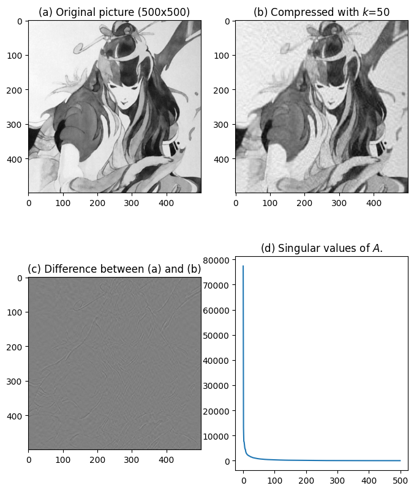

# Image Compression with Singular-Value Decomposition

This study treats a grayscale image as a matrix and reconstructs it using only the largest singular values and their corresponding singular vectors.

## What the notebook implements

- RGB-to-grayscale conversion;
- full singular-value decomposition with NumPy;
- rank-`k` truncation of `U`, `Sigma`, and `V^T`;
- low-rank image reconstruction;
- compression-ratio calculation;
- average relative pixel-difference calculation;
- visualization of the original, reconstruction, difference image, and singular-value spectrum.

## Recorded notebook example

For the stored 500 x 500 example at rank `k = 50`, the notebook reports:

| Quantity | Recorded value |
|---|---:|
| Compression ratio | `0.200200` |
| Average relative difference | `0.051343` |

The report extends the study to five images of different visual styles and discusses how rapid singular-value decay supports lower-rank reconstruction.

## Preserved files

- `HW4_112006265.ipynb` - original implementation notebook.
- `report/HW4_112006265.pdf` - original illustrated analysis report.

## Limitations

- The JPEG referenced by the notebook was not included in the uploaded archive, so the exact notebook run cannot be reproduced from this repository alone.
- The stored numerical results and report discussions are presented as historical outputs, not newly verified benchmarks.
- The report explicitly records where ChatGPT was used; those statements remain unchanged.
